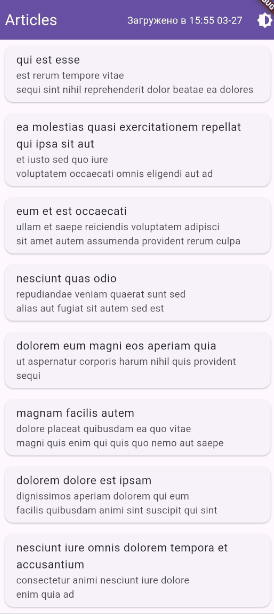
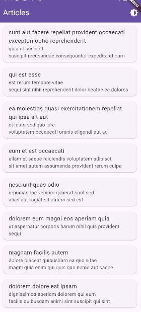

# Article Browser

Приложение для просмотра заметок.

Запуск: 

```sh
fvm global stable
```

```sh
flutter pub get
```

```sh
flutter run
```

Присутствуют VSCode конфигурации для запуска в режимах unit_test/integration_test.

<!--      -->
<div style="display: flex; flex-wrap: wrap; gap: 20px; justify-content: center;">
  <div style="text-align: center;">
    <p>Главный экран</p>
    
  </div>
  <div style="text-align: center;">
    <p>Смена темы</p>
    
  </div>
  <div style="text-align: center;">
    <p>Кэширование</p>
    
  </div>
  <div style="text-align: center;">
    <p>Страница деталей статьи</p>
    
  </div>
</div>